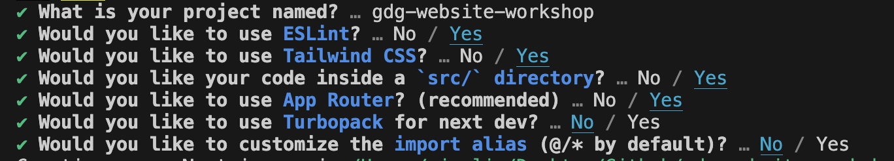

# Google Developer Group Website Workshop

## Setup

On your machine, make sure you have `git`, `node`, and `npm` installed.

For Git: https://git-scm.com/book/en/v2/Getting-Started-Installing-Git

For Node/NPM: https://docs.npmjs.com/downloading-and-installing-node-js-and-npm
 
Choose any IDE of your liking, I'll recommend Visual Studio Code.

### Step 1 - Create app using create-next-app

Choose a directory to run the following command:

```npx create-next-app@latest --typescript```

You will see prompts asking for configuration settings. Go ahead and choose these:



(Note: Just use Left/Right Arrow keys and Enter to select)

Feel free to name your project however

After all the selections, this will create a folder with your project in it!

Go ahead and now open this newly generated folder in Visual Studio Code.


### Step 2 - Link with Git repo

Create a new repository on Github. Then, copy your repo's URL under this green button: 

Then, in this new folder, run these commands to link to your repository. Make sure to replace `[YOUR GIT URL]` with the link copied from earlier.

```
git init .

git remote add origin [YOUR GIT URL]

git add .
git commit -m "Initial commit"

git push origin main
```

### Step 3 - Testing your site
In your project folder, run 
```
npm run dev
```

If all goes well, you should see .

Go ahead to that localhost link and you should see your website!

### Step 4 - Deploying your site
On that localhost, simply click the "Deploy Now" button and follow the steps there! 